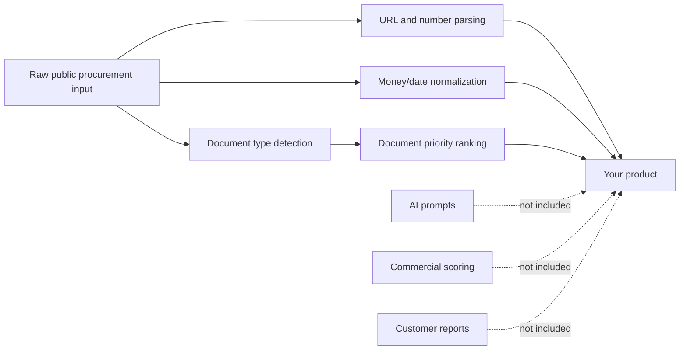
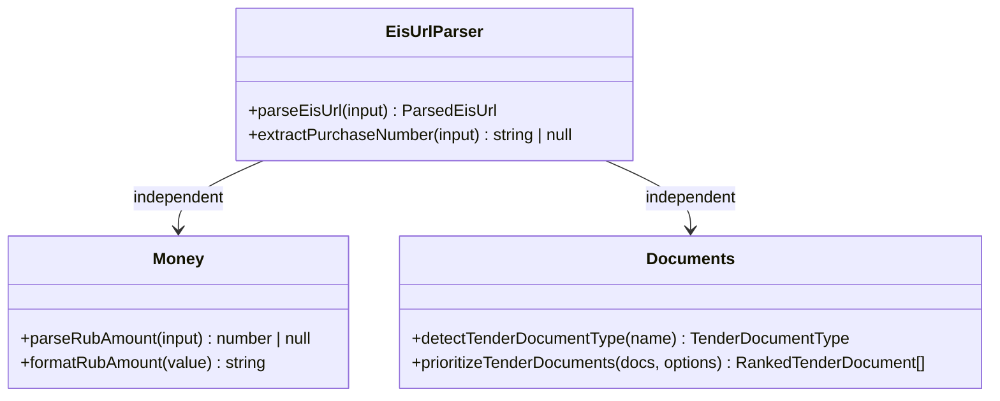

# RU Procurement Toolkit

Framework-neutral TypeScript utilities for Russian procurement and tender products.

This repository contains safe, generic helpers for EIS/Zakupki links, purchase numbers, Russian money/date parsing and document prioritization. It intentionally does **not** include AI prompts, commercial scoring logic, customer data or TenderCheck/TenderCRM proprietary report logic.

## Why

Russian procurement products repeatedly need the same low-level building blocks:

- parse EIS/Zakupki URLs;
- extract purchase numbers from links and text;
- normalize Russian ruble amounts;
- detect document types from filenames;
- rank tender documents before parsing;
- keep public tender tooling typed and reusable.

This toolkit provides those small pieces as open-source infrastructure.

## Install

```bash
bun add ru-procurement-toolkit
# or
npm install ru-procurement-toolkit
```

> Package publishing is planned. For now, use directly from GitHub or as a workspace dependency.

## Usage

```ts
import {
  extractPurchaseNumber,
  parseEisUrl,
  parseRubAmount,
  prioritizeTenderDocuments
} from 'ru-procurement-toolkit';

const url =
  'https://zakupki.gov.ru/epz/order/notice/ea20/view/common-info.html?regNumber=0373100001026000001';

const parsed = parseEisUrl(url);
// { source: 'zakupki.gov.ru', purchaseNumber: '0373100001026000001', ... }

const amount = parseRubAmount('1 250 000,50 руб.');
// 1250000.5

const docs = prioritizeTenderDocuments([
  { name: 'Проект контракта.docx', url: 'https://example.test/contract.docx' },
  { name: 'Техническое задание.pdf', url: 'https://example.test/tz.pdf' },
  { name: 'Архив.zip', url: 'https://example.test/archive.zip' }
]);
```

## Package Boundary



## Design Principles

- No secrets.
- No network calls.
- No AI prompts.
- No customer data.
- No TenderCRM/TenderCheck proprietary logic.
- Small, typed, testable functions.
- Works in Node.js, Bun and browser-compatible bundles where possible.

## API

### `parseEisUrl(input)`

Parses supported EIS/Zakupki URLs and extracts source, purchase number and known query parameters.

### `extractPurchaseNumber(input)`

Extracts a Russian purchase number from URL or free text.

### `parseRubAmount(input)`

Parses common Russian ruble amount formats into a number.

### `detectTenderDocumentType(name)`

Detects generic document type from a public filename: contract, technical specification, notice, protocol, estimate, attachment, archive or unknown.

### `prioritizeTenderDocuments(documents, options?)`

Sorts public tender documents by generic usefulness before parsing.

## Architecture



## What This Is Not

This is not:

- a tender monitoring service;
- an AI tender auditor;
- a parser for private user documents;
- a legal-risk engine;
- a TenderCRM or TenderCheck AI code dump.

Commercial AI analysis, prompts, fit scoring and report generation remain private.

## Author

**Прянишников Артём Алексеевич**
Saratov, Russia
GitHub: [@FrankFMY](https://github.com/FrankFMY)
Telegram: [@FrankFMY](https://t.me/FrankFMY)
Email: [Pryanishnikovartem@gmail.com](mailto:Pryanishnikovartem@gmail.com)
LinkedIn: [frankfmy](https://www.linkedin.com/in/frankfmy/)
X/Twitter: [@FrankFMY](https://x.com/FrankFMY)

## License

Apache-2.0. See [LICENSE](LICENSE).
