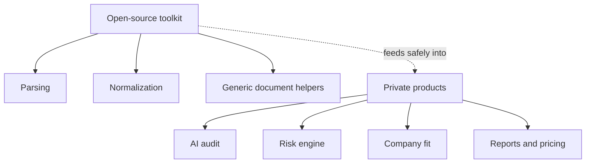

# Scope and Safety Boundary

This repository is intentionally small and public.

## Included

- EIS/Zakupki URL parsing.
- Purchase number extraction.
- Russian ruble amount parsing.
- Generic public document type detection.
- Generic document priority ranking.

## Excluded

- AI prompts.
- Tender risk scoring.
- Company-fit matching.
- Proprietary report templates.
- Customer data.
- Production credentials.
- TenderCRM or TenderCheck AI commercial code.

## Why This Boundary Exists

Open-source procurement utilities can help the community and improve public credibility without giving away the commercial core of TenderCheck AI or TenderCRM.

